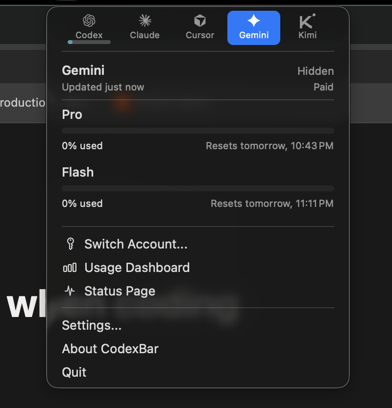

[CodexBar](https://codexbar.com), by Peter Steinberger (same creator of [OpenClaw](https://openclaw.ai)), has become a must-have for me and critical for my work every day. It's a simple bar at the top of your system that shows you your limits for different agent providers.

It includes:

- When the limits reset
- Progress is configurable, so you can tell it to display how much you have left or how much you have used.
- Lots of providers supported: Codex, Claude, Cursor, Gemini, Kimi, Z.AI, etc.
- How much tokens you've used in the last 30 days, how much money that would've been in API usage.

It works by either using your tokens from the tools installation (in the case of Gemini CLI) or your cookies from the browser (you give it permissions to access your Chrome vault), and then hitting the same endpoints those tools use, meaning it's pretty accurate.

It's also open source, so if you find any bugs you can propose a PR, or if you don't understand something, you can ask your agent.

I use this tool absolutely every day. It's a game changer.
