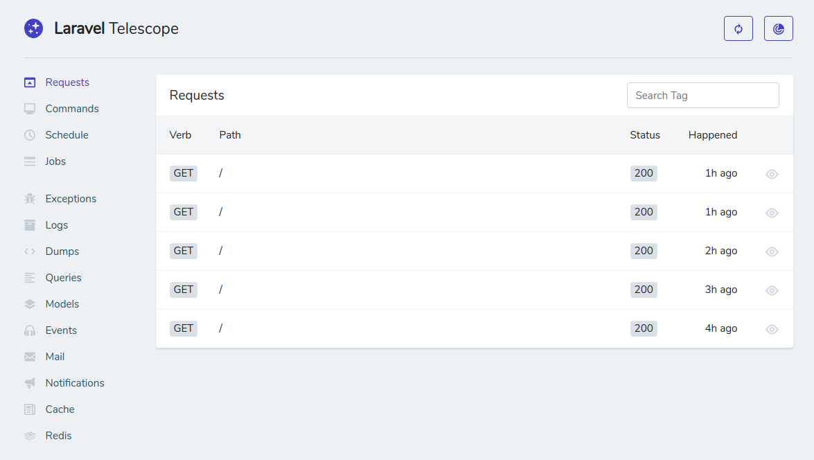

Laravel Telescope is a new debug assistant for the Laravel framework, created by the same people who created Laravel. It was first announced at Laracon AU, and its beta was released shortly after. It’s free and open source, licensed under the MIT license.

You can use Laravel Telescope to debug your requests, exceptions, databases, cache, and much more in real time by accessing a specific route in your local environment.

## Installing Laravel Telescope

Before installing Laravel telescope, you need to have Laravel installed. More specifically, you need  **Laravel 5.7.7**. If you want a fresh install, you can check out the  [Laravel 5.7’s installation guide](https://laravel.com/docs/5.7/#installing-laravel), or you can  [upgrade](https://laravel.com/docs/5.7/upgrade)  if you had Laravel installed already.

To install Laravel telescope, run:

```
composer require laravel/telescope --dev
```

You might get this error if you don’t have the bcmath extension installed:

```
Problem 1
    - moontoast/math 1.1.2 requires ext-bcmath * -> the requested PHP extension bcmath is missing from your system.
    - moontoast/math 1.1.1 requires ext-bcmath * -> the requested PHP extension bcmath is missing from your system.
    - moontoast/math 1.1.0 requires ext-bcmath * -> the requested PHP extension bcmath is missing from your system.
    - laravel/telescope v0.1.5 requires moontoast/math ^1.1 -> satisfiable by moontoast/math[1.1.0, 1.1.1, 1.1.2].
    - Installation request for laravel/telescope ^0.1.5 -> satisfiable by laravel/telescope[v0.1.5].
```

You can quickly fix this by running:

```
sudo apt install php7.2-bcmath
sudo service apache2 restart
```

Use  `php7.1-bcmath`  if you have PHP 7.1.

Now you can run  `composer require laravel/telescope --dev`  again.

After the installation is set and done, you can move prepare the assets, config files and database by running:

```
php artisan telescope:install
php artisan migrate
```

## Configuring Laravel Telescope

Right after the installation, you can open the route  `/telescope`  in your browser.




You can change this route in the  `config/telescope.php`  file. This file allows you to configure Telescope. The most important options are:

**path**

This is the path in your app in which Telescope will be accessible. Don’t include slashes. The default value is  `telescope`  .

**driver**

This is where Telescope will store the data. To date,  **you can’t change this value**.  `database`  is the only value supported.

**storage**

This will determine which database connection to use. It’ll use your default database connection.

**limit**

This will determine how much data Telescope will store for everything you will debug. The default value is  `100`  .

## Determining who has access to Telescope

In your local environment, any user can access Telescope. In other environments, only selected users can access Telescope. To configure the access in, let’s say, production, you need to go to  `app/Providers/TelescopeServiceProvider.php`  and find the  `gate`  function.

```
protected function gate()
    {
        Gate::define('viewTelescope', function ($user) {
            return in_array($user->email, [
                //
            ]);
        });
    }
```


You can add a list of emails. Users with this email will have access to Telescope. However, my recommended approach for this is to use  **environment variables and IDs**, because:

-   You can have different emails locally / in production.
-   You can change your email and then you’ll have to change your code.
-   This feels like storing access tokens in your code, especially if you’re using version control.

To use IDs, you can modify the function and make it look like this:

```
protected function gate()
    {
        Gate::define('viewTelescope', function ($user) {
            $ids = env('TELESCOPE_USERS', '');
            $ids = explode(',', $ids);
            return in_array($user->id, $ids);
        });
    }
```

Now you can set your environment variable, separating them with a comma:

```
TELESCOPE_USERS=1,2
```

Remember not to add spaces between your IDs.

Now you can explore Laravel Telescope!
