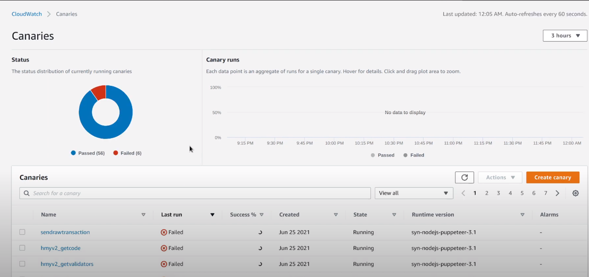

If you have an API that people can make calls to, you'd love to make sure that it's up and running at least 99.9% of the time. You probably know how big companies have public status pages, such as [Netlify](https://www.netlifystatus.com/), [AWS](https://status.aws.amazon.com/), [Shopify](https://www.shopifystatus.com/), among others, in which they check the status of their own services and then let you know if they're down.

Not only this is useful for the people calling your API, but it's also useful for you, since you can notify yourself whenever your API or one of your endpoints is not working as intended, so the problem can fixed before anybody has a chance to complain.

This can be easily automated by using AWS Cloudwatch Synthetics.



CloudWatch Canaries are scripts that can run on a schedule to monitor endpoints. They can be used to replicate the behavior of a piece of code interacting with an API, but they can also mimic the behavior of a user interacting with an application. This can be used to make sure that your application is always up and running as intended.

### Setting up the CDK

For this guide we'll be using the AWS Cloud Development Kit in Typescript. This is because using the AWS console can be a tedious process. You'd have to set up every endpoint one by one and their respective alarms. With the AWS CDK you can just define an array of endpoints, some parameters for each endpoint and then deploy everything with just one command.

The other benefit of this approach is that if you have to change the behavior of all the endpoints, you can also make the changes and just run one command.

For this guide, [Harmony's API](https://docs.harmony.one/home/developers/api) will be used, since I originally built this as a contribution for them.

Make sure you have the [AWS CLI](https://aws.amazon.com/cli/) installed and you're connected to your AWS account.

So let's start off by installing the Typescript CDK if you don't have it already:
```
npm install -g aws-cdk
```

And create a new instance:

```mkdir harmony-synthetics
cd harmony-synthetics
cdk init app --language typescript
```

And install other dependencies we're going to need:
```
npm install @aws-cdk/aws-synthetics @aws-cdk/aws-cloudwatch @aws-cdk/aws-s3 @types/puppeteer
```

### Defining the endpoints

This is optional, but since we're using Typescript, we can define the type of the object that will store the API results.

Let's put it at `models/index.ts`:
```typescript
export type RCPParam = number | string | boolean | { [key: string]: RCPParam };
export type RCPResult = 'string' | 'number' | 'object' | 'boolean';

export interface RCP {
  host: string;
  name: string;
  params: RCPParam[];
  result: RCPResult;
}
```

So the RCP contains:
- **host**: The API URL that will be called.
- **name**: A name for that particular host, which will be used to name the synthetic canary as well.
- **params**: Parameters for the query string.
- **result**: What to expect from this endpoint. If this is not what is returned, an error will be thrown.

Please note that this is adapted for Harmony's API and yours may be simpler or more complex.
This setup assumes that a 200 OK response will always contain a success response, and there's no need to check for an error in the returned object.

Now we can fill an array with endpoints. As many as needed, located at `lib/methods.ts`:

```typescript
import { RCP } from '../models';

// https://api.hmny.io/ has these:
const MAINNET_S0 = 'rpc.s0.t.hmny.io';
const MAINNET_S1 = 'rpc.s1.t.hmny.io';

const methods: RCP[] = [
  {
    host: MAINNET_S0,
    name: 'hmyv2_call',
    params: [
      { to: '0x08AE1abFE01aEA60a47663bCe0794eCCD5763c19' },
      370000
    ],
    result: 'string',
  },
  // ... many more
];
```

### Defining the Canary

We need to define the piece of code that will execute the API Call. In this process, we tell AWS what call we want to make and how to handle the response. This works with a Lambda that can take one of the RCP methods we defined above and execute them.

Once again this step is optional, but I defined the Typescript definitions for the Synthetics function, and you can find them [here](https://github.com/Zerquix18/harmony-cloudwatch/blob/master/models/synthetics.ts).

You can put them in `models/synthetics.ts` and re-export them from your `models/index.ts`:
```typescript
export * from './synthetics';
```

So let's define the resulting lambda and go over how it works:

```typescript
import { APICanarySynthetics, APICanarySyntheticsExecuteHttpStepCallback, APICanarySyntheticsExecuteHttpStepRequestOptions, APISynthethicsConfigurationOptions, RCP } from "../models";
const synthetics = require('Synthetics') as APICanarySynthetics;

type JSONResponse = {
  [key: string]: string | number | JSONResponse;
}

const handler = async function () {
  const method = JSON.parse(process.env.method!) as RCP;

  const payload = {
    jsonrpc: '2.0',
    id: 1,
    method: method.name,
    params: method.params,
  };
  const payloadString = JSON.stringify(payload);

  const stepName = method.name;
  const requestOptions: APICanarySyntheticsExecuteHttpStepRequestOptions = {
    hostname: method.host,
    method: 'POST',
    protocol: 'https:',
    headers: {
      'Content-Type': 'application/json',
    },
    body: payloadString,
  };

  const callback: APICanarySyntheticsExecuteHttpStepCallback = async (response) => {
    const json = await new Promise<JSONResponse>((resolve, reject) => {
      if (! response.statusCode) {
        return reject('Could not get status code');
      }

      if (! (response.statusCode >= 200 && 299 >= response.statusCode)) {
        return reject(`Status code out of range (200-299): [${response.statusCode}]: ${response.statusMessage}`);
      }

      let responseBody = '';

      response.on('data', (d: string) => {
        responseBody += d;
      });

      response.on('end', () => {
        if (responseBody.length === 0) {
          return reject('Empty response.');
        }

        const body = JSON.parse(responseBody);
        resolve(body);
      });
    });

    if (! ('jsonrpc' in json)) {
      throw new Error(`'jsonrpc' not found in body.`);
    }

    if (! ('id' in json)) {
      throw new Error(`'id' not found in body.`);
    }

    if (! ('result' in json)) {
      throw new Error(`'result' not found in body.`);
    }

    const result = json.result;

    if (method.result !== typeof result) {
      throw new Error(`'result' in body is not the expected type: ${method.result}`);
    }

    // all good at this point. Further validation can be added to account for the full shape of `result`
    // if it's an object.

  };

  const stepConfig: APISynthethicsConfigurationOptions = {
    includeRequestHeaders: true, 
    includeResponseHeaders: true,
    includeRequestBody: true,
    includeResponseBody: true
  };

  await synthetics.executeHttpStep(stepName, requestOptions, callback, stepConfig);
};

export { handler };
```

Should be stored at `canary/index.ts`.

This lambda will:
1. Receive an RCP method as a JSON string from an environment variable.
2. Define the headers and payload to be sent to the API, in the format that the Synthetics functions require it.
3. Check that we got a status code between 200-299 and an actual response.
4. Read the entire response.
5. Make some basic checks for how an actual response would look like.
6. Compare the expected result with the actual result.

So you can think of this lambda as an isolated piece of code that runs and verifies an RCP from the array you define.

### Automating the creation of each Canary

Now we want to modify our stack file to loop through every RCP and create a Canary and alarms for it. This file ends in `-stack.ts` and is located inside the `lib/` directory. It's auto-generated by the cdk script.

The first step however, is to define a bucket to store the logs.

```typescript
const bucket = new s3.Bucket(this, `CanariesBucket`, {
  bucketName: 'canaries-logs-bucket',
});
```

Now we can loop:

```typescript
let names: string[] = [];
methods.forEach(method => {
  // canary names cannot be longer than 21 characters and cant have uppercase letters
  // this is my attempt to have some kind of naming convention that is consistent and represents whats being called
  // this should probably be reviewed
  let canaryName = method.name.toLowerCase();
  if (canaryName.length > 21) {
    canaryName = canaryName.replace('hmyv2_', '');
    if (canaryName.length > 21) {
      canaryName = canaryName.substr(-21);
    }
  }
  if (names.indexOf(canaryName) !== -1) {
    canaryName = canaryName.substr(-20) + '2';
  }

  names.push(canaryName);

  const canary = new synthetics.Canary(this, `Canary_${method.name}`, {
    canaryName,
    runtime: synthetics.Runtime.SYNTHETICS_NODEJS_PUPPETEER_3_1,
    schedule: synthetics.Schedule.rate(Duration.minutes(5)),
    test: synthetics.Test.custom({
      code: synthetics.Code.fromInline(fs.readFileSync(path.join(__dirname, '../canary/index.js'), 'utf8')),
      handler: 'index.handler',
    }),
    environmentVariables: {
      method: JSON.stringify(method),
    },
    artifactsBucketLocation: { bucket },
  });

  const successAlarm = new cloudwatch.Alarm(this, `Canary_${method.name}SuccessAlarm`, {
    metric: canary.metricSuccessPercent(),
    comparisonOperator: cloudwatch.ComparisonOperator.LESS_THAN_THRESHOLD,
    threshold: 90, // %
    evaluationPeriods: 1, // minute
  });

  const durationAlarm = new cloudwatch.Alarm(this, `Canary_${method.name}DurationAlarm`, {
    metric: canary.metricDuration(),
    comparisonOperator: cloudwatch.ComparisonOperator.GREATER_THAN_THRESHOLD,
    threshold: 30000, // ms
    evaluationPeriods: 5, // minute
  });
});
```

This loop will:
1. Generate a name, since certain characters are not allowed.
2. Create a Canary using the method name, that will run every **5 minutes**, passing the code from the Canary, the environment variables and the bucket for the logs.
3. A success alarm that will alert you if it DOES NOT succeed 90% of the time in a 1-minute timeframe.
4. A duration alarm if it lasts more than 30 seconds in a 5-minute timeframe.

So the whole file would look like this:

```typescript
import * as cdk from '@aws-cdk/core';
import * as synthetics from '@aws-cdk/aws-synthetics';
import * as cloudwatch from '@aws-cdk/aws-cloudwatch';
import * as s3 from '@aws-cdk/aws-s3';
import * as path from 'path';
import * as fs from 'fs';
// weird! can't use cdk.Duration
import { Duration } from '@aws-cdk/aws-cloudwatch/node_modules/@aws-cdk/core';

import methods from './methods';

export class HarmonyCloudwatchStack extends cdk.Stack {
  constructor(scope: cdk.Construct, id: string, props?: cdk.StackProps) {
    super(scope, id, props);

    const bucket = new s3.Bucket(this, `CanariesBucket`, {
      bucketName: 'canaries-logs-bucket',
    });

    let names: string[] = [];
    methods.forEach(method => {
      // canary names cannot be longer than 21 characters and cant have uppercase letters
      // this is my attempt to have some kind of naming convention that is consistent and represents whats being called
      // this should probably be reviewed
      let canaryName = method.name.toLowerCase();
      if (canaryName.length > 21) {
        canaryName = canaryName.replace('hmyv2_', '');
        if (canaryName.length > 21) {
          canaryName = canaryName.substr(-21);
        }
      }
      if (names.indexOf(canaryName) !== -1) {
        canaryName = canaryName.substr(-20) + '2';
      }

      names.push(canaryName);

      const canary = new synthetics.Canary(this, `Canary_${method.name}`, {
        canaryName,
        runtime: synthetics.Runtime.SYNTHETICS_NODEJS_PUPPETEER_3_1,
        schedule: synthetics.Schedule.rate(Duration.minutes(5)),
        test: synthetics.Test.custom({
          code: synthetics.Code.fromInline(fs.readFileSync(path.join(__dirname, '../canary/index.js'), 'utf8')),
          handler: 'index.handler',
        }),
        environmentVariables: {
          method: JSON.stringify(method),
        },
        artifactsBucketLocation: { bucket },
      });

      const successAlarm = new cloudwatch.Alarm(this, `Canary_${method.name}SuccessAlarm`, {
        metric: canary.metricSuccessPercent(),
        comparisonOperator: cloudwatch.ComparisonOperator.LESS_THAN_THRESHOLD,
        threshold: 90, // %
        evaluationPeriods: 1, // minute
      });

      const durationAlarm = new cloudwatch.Alarm(this, `Canary_${method.name}DurationAlarm`, {
        metric: canary.metricDuration(),
        comparisonOperator: cloudwatch.ComparisonOperator.GREATER_THAN_THRESHOLD,
        threshold: 30000, // ms
        evaluationPeriods: 5, // minute
      });

    });
  }
}
```

### Running the result

Now we can compile the Typescript...

```npm run build```

... and then deploy the result to the cloud:

```cdk deploy```

And in a few minutes, you should have all your Canaries running.

You can see the full code put together on my [Github](https://github.com/Zerquix18/harmony-cloudwatch) and can run the command to deploy it on your AWS account.
